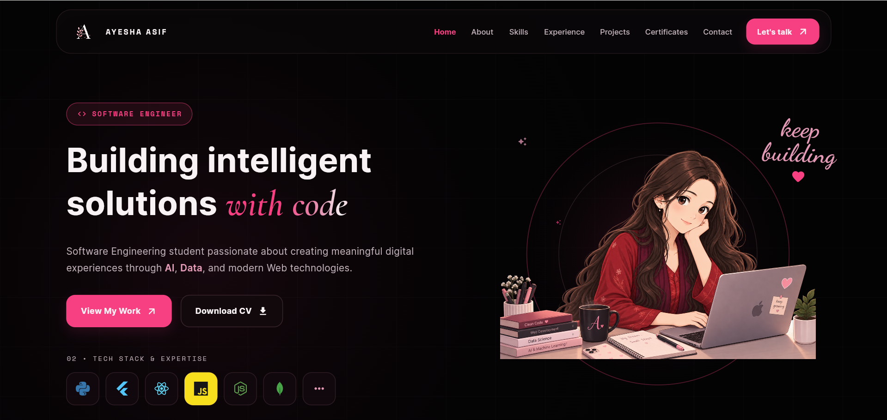
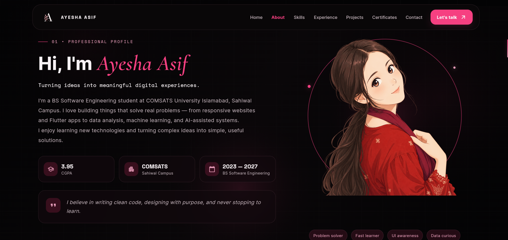
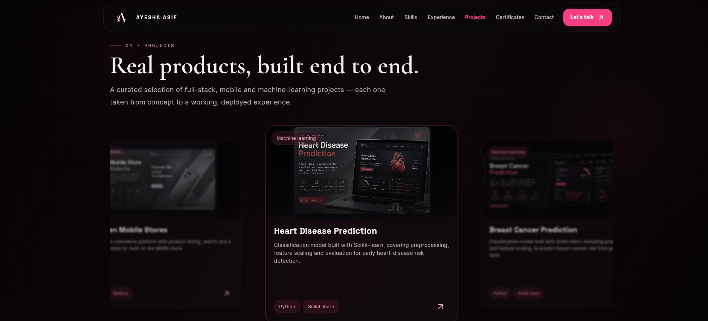
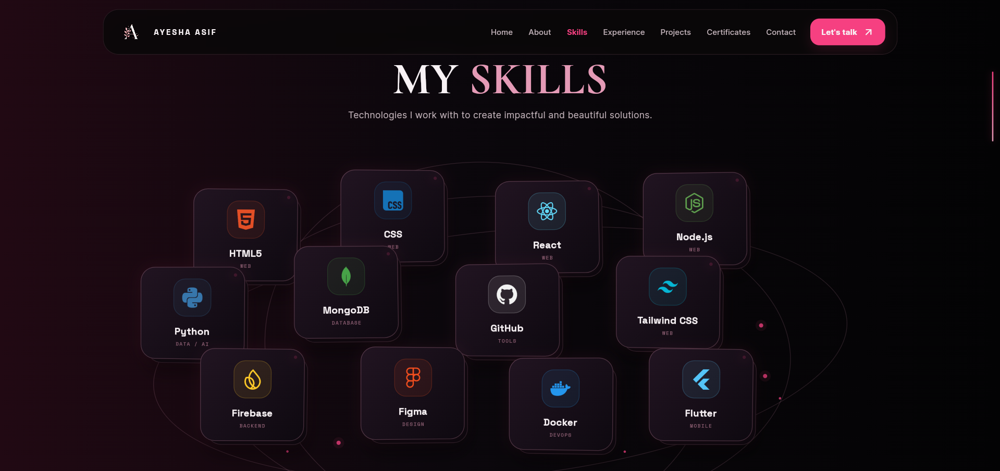
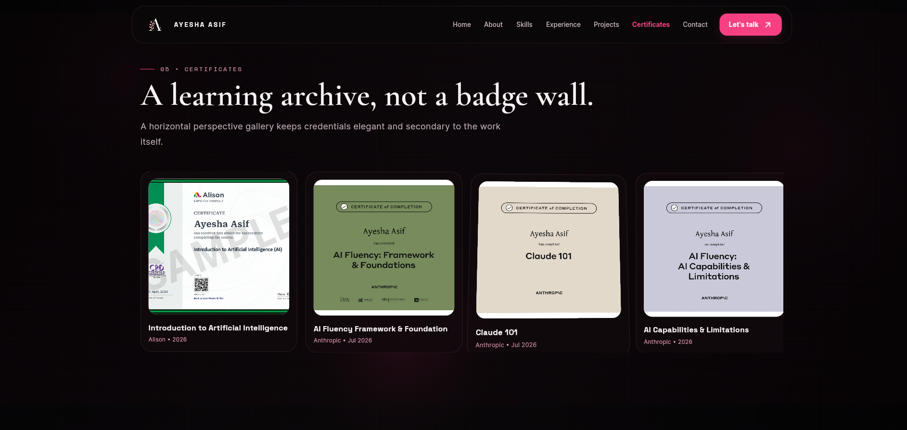
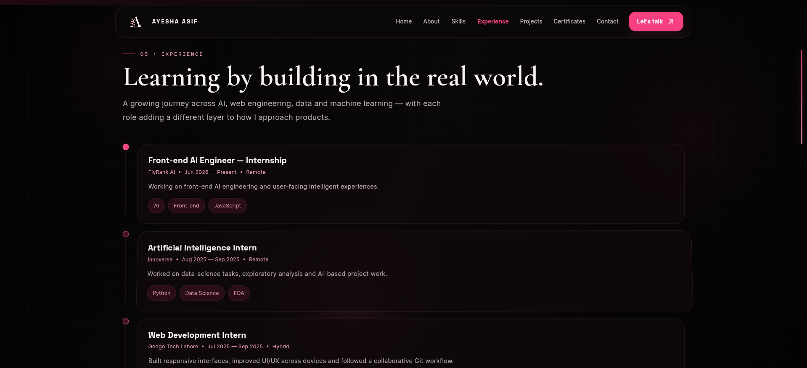
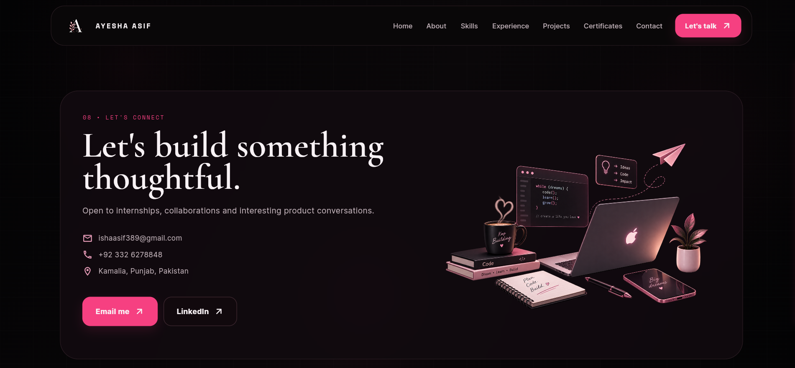

# Ayesha Asif Portfolio

A modern and interactive personal portfolio application built with Flutter and Dart.

This project showcases my skills, projects, certifications, experience, and professional journey through a clean, responsive, and user-focused digital portfolio.

---

## About This Project

Ayesha Asif Portfolio is a Flutter-based portfolio application designed to present my technical skills, creative work, and development journey.

The application focuses on:

- Modern and clean UI design
- Responsive layouts
- Smooth animations
- Professional user experience
- Well-structured Flutter architecture

---

## Features

- Hero introduction section
- About me section
- Skills showcase
- Project portfolio
- Experience timeline
- Certifications display
- Resume download functionality
- Contact section
- Responsive design for different screen sizes

---

## Technologies Used

- Flutter
- Dart
- Material Design
- Custom Flutter Widgets
- Responsive UI Design

---

## Project Structure
lib/
|
├── app/
| └── Application configuration
|
├── core/
| └── Shared widgets and utilities
|
├── features/
| ├── About
| ├── Projects
| ├── Skills
| ├── Experience
| ├── Certifications
| └── Contact
|
├── page/
| └── Portfolio pages
|
└── assets/
├── images/
├── certificates/
├── resume/
└── Screenshots/

---

# Screenshots

## Home Section

## About Section

## Projects Section

## Skills Section

## Certifications Section

## Experience Section

## Contact Section

---

## Purpose

The purpose of this project is to create a professional digital portfolio that represents my development skills and demonstrates my ability to build modern Flutter applications.

---

## Future Improvements

- Add more projects and case studies
- Improve animations and interactions
- Deploy the portfolio online
- Add additional customization options

---

## Contact

GitHub: https://github.com/your-username

LinkedIn: Add your LinkedIn profile

Portfolio: Coming soon

---

Built with Flutter and Dart by Ayesha Asif
